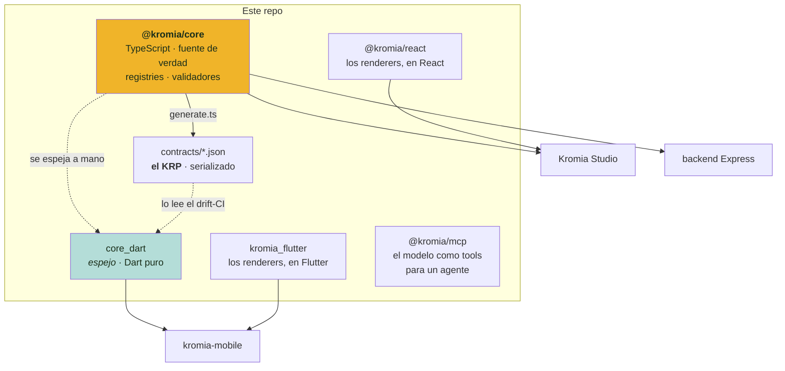

<div align="center">

# kromia-sdk

**El contrato de Kromia: el modelo se escribe una vez y todas las plataformas obedecen.**

[](https://www.typescriptlang.org)
[](https://dart.dev)


[](https://luishidalgoa.github.io/kromia-sdk/)

</div>

---

## Qué es esto

Kromia deja que cada creador **defina la estructura de sus cartas** —qué campos tienen, cómo
se agrupan, cómo se renderizan— sin escribir código. Eso significa que «qué es una carta» no
es algo que sepa cada aplicación por su cuenta: es un **modelo de datos** que hay que
interpretar igual en un navegador, en un servidor Node y en un móvil Flutter.

Este repo es ese modelo. Y existe por una razón concreta: **si vive en un solo sitio, los
hosts no pueden divergir.**

La alternativa —que Studio, el backend y la app implementen cada uno su versión de las
reglas— no falla el primer día. Falla el tercer mes, cuando una carta se ve de una manera en
la web y de otra en el móvil y nadie sabe cuál de las tres implementaciones tiene razón.

---

## Cómo se reparte



**`@kromia/core` manda.** Lo demás lo obedece: `core_dart` lo espeja a mano en Dart, el KRP lo
serializa para quien no puede importar TypeScript, y un CI comprueba que el espejo no se ha
quedado atrás.

Los tres repos cliente lo consumen **como submódulo git**, no desde npm ni pub.dev.

---

## Los paquetes

| Paquete | Qué es |
|---|---|
| **`packages/core`** | `@kromia/core`. El modelo: registries (field-types, behaviors, recipes, actions, slot-kinds, efectos), validadores puros y la enciclopedia de cada concepto. Sin dependencias de runtime. |
| **`packages/react`** | `@kromia/react`. Los renderers como componentes, al estilo Stripe Elements. Los consume Studio. |
| **`packages/core_dart`** | `kromia_core`. El espejo Dart, **paquete puro** (su pubspec no lleva Flutter). |
| **`packages/flutter`** | `kromia_flutter`. El motor de render del árbol de layout: el equivalente de `@kromia/react`. |
| **`packages/mcp`** | `@kromia/mcp`. Expone el modelo como **tools deterministas** para que un agente diseñe álbumes razonando con la verdad del sistema en vez de inventársela. |

Y dos carpetas que no son paquetes pero pesan igual:

- **`contracts/`** — el **KRP** (`kromia-recipe-protocol-v1.json`), el modelo serializado y
  versionado. Lo consumen el drift-CI y las plataformas que no pueden importar TS.
- **`playbooks/`** — los procesos paso a paso («voy a añadir un behavior», «voy a cerrar una
  tarea»). Cada repo cliente los importa desde su `AGENTS.md`.

---

## Puesta en marcha

No hay servidor que levantar ni build previo: los consumidores transpilan el `src/` directo.

```bash
git clone https://github.com/luishidalgoa/kromia-sdk.git
cd kromia-sdk
pnpm install
pnpm test          # 54 ficheros, 1220 tests, ~7 s
```

Si vas a tocar el espejo Dart:

```bash
cd packages/core_dart && dart test      # 829 tests
```

**Con `dart test`, nunca con `flutter test`.** `core_dart` es un paquete Dart **puro**: si
alguien cuela un `import 'dart:ui'`, el paquete deja de compilar entero y el CI cae en todos
los push. `flutter test` sí trae `dart:ui`, así que **enmascara el fallo** — así se coló una
vez y aguantó veinte push.

---

## Versionado: dos ejes que no se mezclan

Esta es la parte que más confusión causa, así que va explícita:

- **El `protocolVersion` del KRP** (hoy `5.9.0`) es el eje del **contrato**. Lo bumpea
  `generate.ts` automáticamente cuando cambia un registry. Es cosa de máquinas.
- **La versión de cada app** (Studio, backend, Flutter) es **SemVer curada a mano** con su
  `CHANGELOG.md`, y va por su cuenta.

No son lo mismo y no se sincronizan. Un cambio que solo añade DATOS no toca el
`protocolVersion`: se acumula en `[Unreleased]` del CHANGELOG de este repo.

Detalle en [`playbooks/versioning.md`](playbooks/versioning.md) y
[`playbooks/bump-protocol.md`](playbooks/bump-protocol.md).

---

## Cómo se trabaja aquí

Antes de tocar nada, mira si hay un playbook: [`playbooks/INDEX.md`](playbooks/INDEX.md).
Añadir un behavior, una receta o un efecto tiene pasos que se olvidan solos, y el orden
importa (por ejemplo, **el SDK se pushea antes que sus consumidores**, o dejas a un repo
apuntando a un commit que no existe en el remoto).

| Comando | Qué hace |
|---|---|
| `pnpm test` | Los tests de los paquetes TS |
| `pnpm --filter @kromia/core gen` | Regenera el KRP desde los registries |
| `pnpm --filter @kromia/mcp start` | El servidor MCP por stdio |
| `mkdocs serve` | El sitio de documentación en local |

---

## Trampas conocidas

- **Nada de `dart:ui` en `core_dart`.** Los colores viajan como el mismo literal string que el
  TS (`#rrggbb`), y cada host los convierte a su tipo.
- **Editar el submódulo no es editar el SDK.** Si trabajas desde el clon de un repo cliente,
  estás tocando su copia. La fuente es este repo, en su propio directorio.
- **El espejo Dart se hace a mano**, no se genera. Al añadir algo al contrato hay que
  espejarlo, y hay un CI que lo comprueba.
- **`packages/protocol-ts` está vacío**: es un residuo, no toca nada.

---

## Documentación

| Para qué | Dónde |
|---|---|
| Consumir el SDK: conceptos, quick start | [Sitio docs](https://luishidalgoa.github.io/kromia-sdk/) |
| Mantenerlo desde dentro: praxis y gotchas | [`AGENTS.md`](AGENTS.md) |
| Procesos paso a paso | [`playbooks/INDEX.md`](playbooks/INDEX.md) |
| Specs cross-platform (efectos, foil, cartas físicas, impresión) | [`docs/`](docs/) |
| Reparto entre los tres chats que mantienen esto | [`COORDINATION.md`](COORDINATION.md) |
| Qué ha cambiado | [`CHANGELOG.md`](CHANGELOG.md) |

> Diez de las specs de `docs/` **no están publicadas** en el sitio MkDocs (no entran en su
> `nav`). Se leen desde el repo.

---

<div align="center">

Proyecto privado · seguimiento en Jira, proyecto `KRO`

</div>
